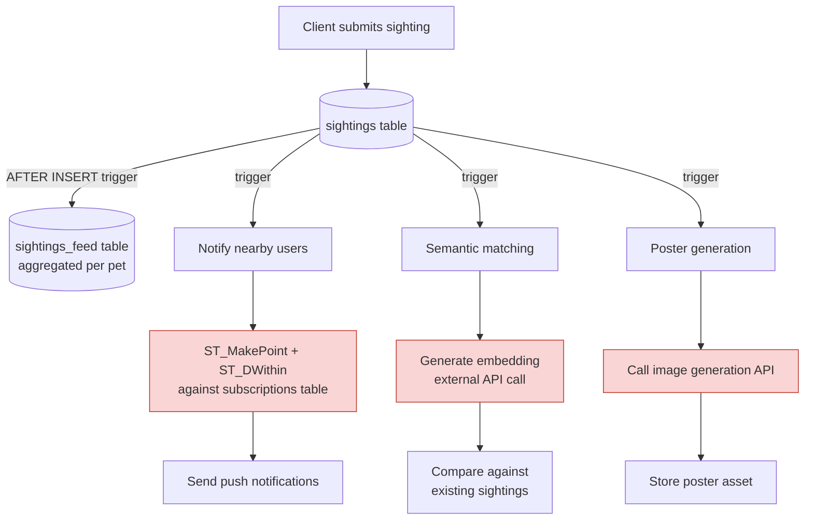
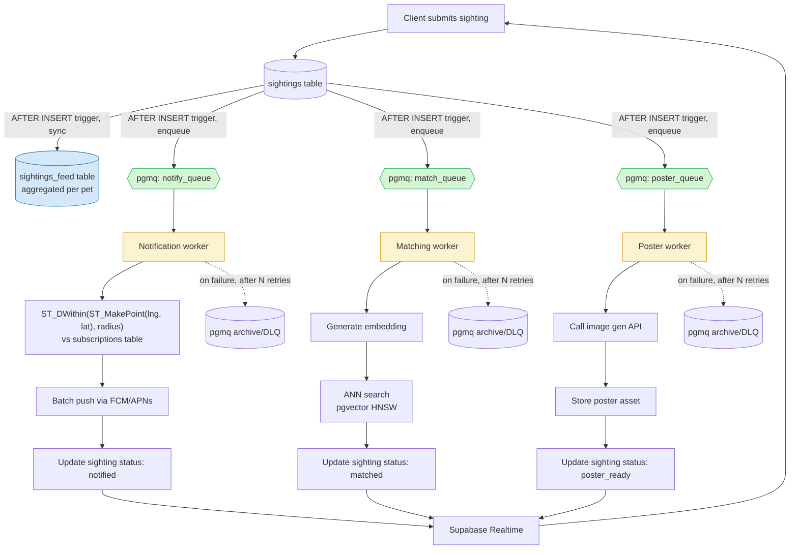

# From DB Triggers to Event-Driven: Scaling SpotAPaw Sighting Pipeline

## Context

SpotAPaw lets users submit a report ("saw a dog matching this description at this location"). Three things need to happen after a sighting is submitted:

1. **Notify** nearby users
2. **Semantic match** against existing lost-pet reports
3. **Generate a poster** for sharing

This is a review of the current implementation and a proposed redesign for production scale (thousands of concurrent users, millions of sightings).

---

## Current Architecture

The current design uses Supabase (Postgres) triggers to orchestrate the entire pipeline:

- Client inserts a row into `sightings`
- An `AFTER INSERT` trigger upserts into a second table, `aggregated_sightings` — a per-pet aggregation of all linked sightings (last known location, sighting count, most recent timestamp, etc.), functioning as a hand-rolled materialized view so the UI's feed can read one row per pet instead of joining/aggregating across every linked sighting
- That same trigger path also kicks off notification fan-out, semantic matching, and poster generation

**Highlighted in red**: steps that run synchronously, inside (or directly chained off) the original database transaction — including two external network calls (embedding generation, poster generation) and a radius query against subscribers.

### Where this design is actually reasonable

The `aggregated_sightings` aggregation table is a legitimate pattern. Denormalizing "all sightings for this pet" into one row that the UI feed can read directly is exactly what you want instead of aggregating across a growing `sightings` table on every read. Keeping it updated via trigger is a defensible choice too, since it's a same-database, low-latency write with no external calls involved — there's little upside to moving it off the synchronous path.

The problem isn't the feed table. It's that the **same insert** is also the trigger point for three unrelated, higher-latency, externally-dependent processes (notifications, matching, poster generation), all riding on the same synchronous trigger chain as that lightweight aggregation update.

### Why the fan-out side doesn't scale

| Issue | Impact |
|---|---|
| Triggers execute synchronously | A slow or failed downstream call (e.g. image gen API timeout) can block or fail the original insert |
| No retry / backoff | A transient failure in any of the three steps has no recovery path — it just fails |
| No dead-letter handling | Failed sightings silently vanish from the pipeline with no record to reprocess |
| No backpressure | A burst of sightings fans out into a burst of external API calls with no throttling, risking rate limits |
| Business logic lives in SQL triggers | Hard to test, hard to observe, hard to review in normal code review |
| Tight coupling | A slowdown in poster generation (GPU/API-bound, seconds of latency) can affect the notification path (should be sub-second) |
| Radius query on every insert, inline | `ST_DWithin` against the subscriptions table runs synchronously in the request path; without an index it degrades badly, and even indexed, it's a query you don't want blocking the write |

This works fine in a prototype with a handful of users. It breaks down as soon as any single downstream step becomes slow, flaky, or high-volume — which, at thousands to millions of users, is guaranteed.

---

## Proposed Architecture

The core change: **decouple the write from the fan-out**, and give each downstream concern its own independent, async, retryable worker — while leaving the feed aggregation update where it already works well: on the synchronous trigger path.

- The insert happens, and the `aggregated_sightings` row is upserted synchronously via trigger, exactly as today. It's a same-database, low-latency write with no external calls — there's no upside to moving it off the synchronous path.
- In the same transaction, a message is enqueued onto **`pgmq`** (Postgres-native queue, runs inside Supabase — no new infrastructure to stand up) instead of the insert directly invoking notification/matching/poster logic.
- Three independent workers poll their respective `pgmq` queues, each scaling and failing independently of the other two.
- The notification worker resolves nearby subscribers using `ST_MakePoint` + `ST_DWithin` against the `subscriptions` table, run inside the worker instead of inline on the write path.
- Status updates flow back to the client via Supabase Realtime instead of polling.

### Key changes and why they matter

**1. Feed aggregation stays as-is**
The `aggregated_sightings` table keeps being maintained by a synchronous `AFTER INSERT` trigger, upserting per-pet aggregates (last location, sighting count, latest timestamp). No external calls, no meaningful latency risk — this part of the current design doesn't need to change.

**2. `pgmq` instead of ad hoc trigger cascade**
The same insert trigger that used to call notification/matching/poster logic directly instead sends a message onto three `pgmq` queues (`notify_queue`, `match_queue`, `poster_queue`). `pgmq` runs as a Postgres extension inside Supabase, so this adds no new infrastructure, while giving you:
- **Visibility timeout + retry** — a message that isn't acknowledged becomes visible again for another consumer to retry
- **Archive/DLQ semantics** — `pgmq.archive()` moves a message out of the active queue after it exceeds retry limits, instead of it silently disappearing
- **Decoupled consumption** — each worker reads only its own queue, at its own pace

**3. Independent workers per concern**
- **Notification worker**: pulls from `notify_queue`, runs `ST_DWithin(ST_MakePoint(sighting.lng, sighting.lat)::geography, subscriptions.location::geography, radius_meters)` against the `subscriptions` table (with a GIST index on `subscriptions.location`), then batches push notifications to matched subscribers. This is the most latency-sensitive path and should be fast and isolated from the other two.
- **Matching worker**: pulls from `match_queue`, generates an embedding (external API call), runs ANN search (pgvector with HNSW/IVFFlat once volume justifies it).
- **Poster worker**: pulls from `poster_queue`, calls the image generation API (slow, expensive, likely GPU/API-bound) — the natural bottleneck of the system, and now isolated so it can't slow down notifications or matching.

Each worker:
- Scales independently based on its own load profile
- Reads its own `pgmq` queue at its own rate — no shared blocking with the other two
- Is idempotent — safe to reprocess the same sighting ID without side effects (e.g. double notifications)

**4. Rate limiting / circuit breaking on external calls**
Both the embedding API and the image generation API are external dependencies with their own rate limits and cost profiles. Workers should rate-limit and circuit-break these calls so a burst of sightings doesn't cascade into throttling or a cost spike.

**5. Realtime status updates**
Instead of the client polling for "is my poster ready yet," each worker updates the sighting's status, and Supabase Realtime pushes that change to the client directly.

---

## Summary

| | Current | Proposed |
|---|---|---|
| Feed aggregation | Sync trigger → `aggregated_sightings` | Unchanged — sync trigger → `aggregated_sightings` |
| Fan-out orchestration | Sync trigger cascade | `pgmq` queues + independent workers |
| Failure handling | None — silent failure | `pgmq` retry/visibility timeout + archive |
| Coupling | All 3 concerns tied to trigger execution | Fully decoupled, independent scaling |
| Client updates | Implicit / polling | Realtime status push |
| Geospatial lookup | Inline `ST_DWithin` on write path | `ST_DWithin` inside notification worker, indexed |
| Vector search | Ad hoc | Indexed ANN (pgvector HNSW) |
| Backpressure | None | Per-worker consumption + rate limiting |

The functional shape of the pipeline (sighting → notify + match + generate poster) doesn't need to change, and neither does the feed aggregation pattern — it's a good fit for a synchronous trigger. What needs to change is narrower than a full rewrite: swap the trigger-invoked fan-out logic for `pgmq` queues consumed by independent workers. That one change gives every downstream step retries, isolation, and independent scaling, without touching the parts of the design that were already working.
